# MyFin customer ordering and loyalty study — 1 October 2026

This is a design for customer ordering through the existing workspace/company
tenant hosts. It does not enable public ordering, customer registration, social
login, payment processing or marketing delivery in the current deployment.

## Decisions confirmed with the owner

- A guest can order; creating a customer account is optional.
- One customer login should work across `finn3.com` workspaces. Loyalty balances
  and marketing choices remain separate for each workspace.
- For remote pickup, staff may accept and prepare an unpaid order before the
  customer arrives. Counter payment remains mandatory initially.
- Proposed first loyalty rule, pending the owner's preference: one stamp per
  eligible paid order. No reward or discount value is assumed from this study.

## Current system and the boundary it creates

- The working camera scanner in `StockTab.vue` reads stock item and package
  codes. A *shop QR* is different: the customer's phone camera opens a public
  HTTPS menu/order page. It contains shop/table context only and grants no
  login, price, discount or payment authority.
- `myfin.orders` in migration `0016_orders.sql` is a paid-sale fulfillment
  table: its ID must be a POS transaction ID, and a trigger creates it after
  the sale posts. `orders.js` provides staff-only status/history APIs.
  Unpaid customer orders cannot be inserted there as-is.
- `myfin.clients` is a company-scoped staff contact directory, not a verified
  customer database. A cashier-entered email can create a `pos-<sale-id>`
  contact. Matching this email later must not grant account ownership or imply
  marketing permission.
- Staff Better Auth has signup and account linking disabled, and its session
  hook requires staff membership. Customer registration cannot be enabled by
  simply turning on Better Auth signup. The public API currently exposes no
  menu or order endpoints.
- The existing checkout locks products, validates price/tax/rounding, posts an
  immutable paid sale and deducts sellable stock. The independent Stock Record
  ledger for ingredients/packaging is not yet connected to sellable products.

## Customer journey

```mermaid
flowchart LR
  QR[Shop/table QR or direct pickup link] --> Menu[Public menu]
  Menu --> Submit[Guest or signed-in order request]
  Submit --> Accept[Staff checks availability and accepts]
  Accept --> Prepare[Prepare / ready for collection]
  Prepare --> Counter[Customer presents order code and pays at counter]
  Counter --> Sale[One paid POS sale and fulfillment order]
  Sale --> Loyalty[Eligible workspace loyalty credit]
```

Use a dedicated public origin such as
`https://order-bfsb-bali.finn3.com/menu`, `/order` and a private order-status
page. Reserve the `order-` prefix in hostname enrollment and map that exact
host to the company; a friendly `/order` link on the staff/brand host can
redirect there. A printed shop/table QR opens the public `/order` with a
revocable opaque location token; a remote customer can use `/menu` and select
pickup without scanning. The URL is context, not proof of physical presence.
Keep the staff POS at `https://bfsb-bali.finn3.com/pos` with its existing
origin, service worker, POS cache and session. Reject staff API requests on
the public order origin and public order writes on the staff origin. The
public menu uses a separate, allowlisted projection: published name,
description, safe image, options,
price, service availability and estimated pickup time. It must not expose
cost, supplier, internal stock ledger, SKU administration or staff contacts.

At submission, the server resolves the exact tenant host, checks the location
token and service hours, validates item IDs and quantity limits, calculates a
server-owned price/tax/rounding snapshot, and records an idempotent *unpaid*
order request. It returns a short order code plus a private status capability
bound to a host-only guest cookie; an optional signed-in customer session can
also view the order. The short code is for cashier lookup, not for reading
personal details. A guest may later attach an order to an account only after
proving possession of the order and a verified identifier.

Staff see incoming requests in Sales Orders, separate from paid fulfillment.
Accepting a request confirms the pickup/table context, quote and ETA. Staff
can mark it preparing or ready before payment. The customer sees status, but
the request is still unpaid: it is absent from sales/cash-flow reporting and
cannot earn loyalty. Configure expiry, cancellation and no-show handling.
Remote guest pickup needs a reachable contact method and abuse controls;
on-premise table orders can remain contact-free. The shared staff queue can
begin with bounded, visible-tab polling and manual refresh, following the
current Orders pattern, rather than refreshing every open device constantly.

At the counter, the cashier scans the customer's order ticket or enters the
short code, confirms the customer and final amount, and tenders through the
existing POS checkout. The server locks the order request and relevant
products, validates the accepted quote/availability, posts exactly one sale,
lets the existing trigger create the paid fulfillment order, and links both
records in the same transaction. The customer-facing order code stays stable;
if staff already marked the request preparing or ready, carry that state into
the new paid fulfillment order with an auditable event so the queue does not
jump backward to pending. Present request and paid-sale events as one timeline.
A retry returns the original result. A price
or tax change after acceptance requires an explicit revised quote before
payment; it must not silently change the accepted amount. Payment state and
preparation state are distinct, so a ready-but-unpaid pickup is representable.

## Availability and preparation before payment

The first public menu should show an explicit publish/sold-out control for
each sellable product/variant, plus stock-aware availability only where
`trackStock` is enabled. Ingredient Stock Records do not yet prove recipe
availability. Do not claim exact ingredient quantities or a guaranteed item
merely because it appears on the menu.

Staff acceptance should reserve tracked sellable quantities until the pickup
deadline. Available-to-order becomes `on hand - active reservations`; the
existing paid checkout converts that reservation into a stock deduction in
the same transaction. Cancellation before preparation releases it. A no-show
after preparation needs a staff-reviewed waste/stock adjustment, then release
of the reservation; a canceled request never becomes revenue. Untracked menu
items rely on the staff's accept/sold-out decision. Start with small order and
quantity caps so unpaid remote orders cannot exhaust capacity. Ordinary
walk-in POS checkout must also respect active reservations, or it could sell
the same tracked units twice.

## Customer identity, profile and SSO

Use a separate customer principal, tables, API surface, session cookie name
and permission checks from staff and six-digit POS access. A global customer
account contains minimal verified identifiers and provider links; a
workspace-scoped profile holds loyalty and marketing preferences; an explicit
company link connects that account to a staff-visible `client` contact only
after verification or a customer-approved claim. Keep consumer profile,
consent and loyalty data out of the existing staff POS catalog cache.

Reserve an explicit identity host such as `account.finn3.com`. One central
customer login can return to any valid public order host using a short-lived,
single-use handoff bound to the initiating host and browser. Issue host-only
customer sessions; do not use a `.finn3.com` wildcard cookie or reuse staff
handoff/session records. Store external identities by verified provider
`issuer + subject`, not by matching an email string. The currently pinned
Better Auth library can support social/OIDC providers, but this application
has none configured. Adding Google/Apple later requires fixed callbacks,
provider credentials, approved outbound network access, explicit account
linking rules and tests. Email verification can provide the first global
customer login without making registration mandatory for ordering. The
[Better Auth social-provider](https://better-auth.com/docs/concepts/oauth)
and [magic-link](https://better-auth.com/docs/plugins/magic-link) guides show
the available patterns; validate behavior against the pinned `1.7.4`
dependency before using either.

An existing staff contact or old POS receipt is not a verified account.
Leave historical contacts and sale snapshots intact; offer a customer-driven
claim/reconciliation flow rather than bulk merging by matching email or phone.
Show a clear data-use notice at guest contact collection and registration,
keep profile fields minimal, and set retention rules for abandoned orders.

## Basic loyalty and marketing boundary

Model loyalty as an append-only ledger keyed by `workspace_id` and verified
`customer_id`, with unique paid-sale earn entries and explicit redemption,
adjustment and reversal entries. Credit only after a paid sale; no credit for
unpaid, canceled or duplicate orders. Preserve the link to the source sale so
future refunds can reverse credit without rewriting history. The workspace
owner defines reward value and eligibility before redemption is enabled.
The suggested pilot earns one stamp per eligible paid order; a spend-based
points formula remains an alternative if the owner prefers it. Neither changes
the ledger boundary or grants discounts automatically. Do not infer a monetary
benefit from the existing customer contact list.

Keep order-service messages separate from marketing. Record an explicit,
initially unchecked marketing choice per workspace, channel and purpose,
including notice version, timestamp, source and withdrawal. A checkout email
or account creation is not a marketing opt-in. Provide customer access,
correction and withdrawal paths before campaigns. Malaysia's Personal Data
Protection Commissioner identifies rights to know the purpose, access and
correct data, withdraw consent and prevent direct marketing; this plan needs
a current privacy/legal review before marketing activation. See the
[Commissioner's data-subject rights page](https://www.pdp.gov.my/ppdpv1/en/data-subject-rights/)
and [privacy-notice guide](https://www.pdp.gov.my/ppdpv1/wp-content/uploads/2025/01/A-Quick-Guide-to-PRIVACY-NOTICE.pdf).

## Minimal new records and integration points

| Record | Scope and purpose |
| --- | --- |
| `shop_locations` / `shop_qr_tokens` | Company, optional table, active/revoked token, service mode and schedule. |
| `storefront_settings` / product publish flags | Company public catalog projection and sold-out/quantity rules. |
| `order_requests` / `order_request_events` | Company-scoped unpaid intake, server quote, preparation/payment states, pickup window, idempotency and history. |
| `order_reservations` | Company/product/variant quantities reserved until payment, cancellation or no-show review. |
| `customer_accounts` / `customer_auth_*` | Global verified consumer identity, provider IDs and separate sessions. |
| `customer_workspace_profiles` / `customer_company_links` | Workspace loyalty/profile and explicit company contact linkage. |
| `customer_consents` / `loyalty_events` | Purpose/channel consent history and source-linked loyalty ledger. |
| `order_payment_links` | Unique request-to-sale/fulfillment mapping; later provider payment reference. |

Public write endpoints need per-company, per-verified-client and carefully
derived per-IP limits, order quantity/value caps and duplicate-submit controls.
The current Fastify server uses `trustProxy: false`; do not simply trust a
caller-supplied forwarding header to identify customers, or accidentally put
every request behind the tunnel into one rate-limit bucket. Verify the trusted
Cloudflare/nginx proxy chain and load-test menu reads and order submissions.

The payment gateway can be added as a *new tender adapter* that creates and
verifies payment attempts and idempotent provider webhooks, then invokes the
same paid-sale conversion. Do not treat a client redirect or QR scan as proof
of payment. Keep card details in a hosted gateway flow rather than MyFin; PCI
SSC describes PCI DSS as applying to systems that store, process or transmit
payment account data. See [PCI DSS](https://www.pcisecuritystandards.org/standards/pci-dss/).

## Delivery sequence and acceptance

1. **Foundation in development:** add separate public origin and host-bound menu projection,
   publish/availability controls, shop/table QR management and server-owned
   unpaid orders with guest status, limits, history, expiry and staff queue.
2. **Counter conversion:** reservation/price policy, one-time POS tender,
   request-to-sale link, refund/no-show handling and multi-device queue tests.
   Exercise concurrent submissions and simultaneous cashier tender in
   isolated PostgreSQL before any production rollout.
3. **Customer identity:** verified optional accounts, central login and
   workspace-scoped profiles; test that consumer sessions cannot reach staff
   APIs or another workspace's data. A workspace's staff sees only its own
   operational contact/order data, not global account or other-workspace
   history. Add one chosen OIDC provider only after callback and egress
   review.
4. **Loyalty pilot:** source-linked earn/reversal ledger, owner-configured
   reward rule, customer balance/history and an explicit consent center. Do
   not start marketing delivery until notice, opt-in, unsubscribe and mail
   transport are accepted.
5. **Production gate:** back up database/uploads off-host, rehearse restore,
   verify migration and roles, test public/guest abuse boundaries, browser
   test table QR and remote pickup on a physical phone, then deploy versioned
   images with a rollback path. Preserve the current production POS and
   Mailcow workloads throughout.

Session cookies should be narrow and host-only, and OAuth should use a fixed
redirect with state/PKCE; see [OWASP session guidance](https://cheatsheetseries.owasp.org/cheatsheets/Session_Management_Cheat_Sheet.html)
and [OAuth guidance](https://cheatsheetseries.owasp.org/cheatsheets/OAuth2_Cheat_Sheet.html).
