# MyFin customer ordering, accounts and loyalty architecture

Implementation state: source complete and accepted in isolation on 1 October
2026. This document describes migration `0018_customer_ordering.sql` and the
matching API and Vue application. A release receipt remains authoritative for
whether a particular development or production deployment is live.

## Product decisions implemented

- Customers may place an order as a guest. Creating an account is optional.
- One customer account is global. Its profile, marketing choices and loyalty
  balance are scoped to the workspace currently serving the storefront.
- Table service starts from a shop QR. Remote pickup can start from a direct
  menu link and requires an email address or phone number.
- Staff prepare an unpaid remote order only after accepting it.
- The first payment path is payment at the counter. Online payment is not
  enabled.
- The first loyalty rule is one stamp for each eligible paid order. The
  workspace owner controls whether earning is enabled, the minimum spend, the
  number of stamps required and the reward label. Redemption is not enabled.

The resulting customer journey is:

```mermaid
flowchart LR
  Link[Shop QR or pickup link] --> Menu[Published public menu]
  Menu --> Quote[Server-priced quote]
  Quote --> Request[Guest or account order request]
  Request --> Accept[Staff accepts and reserves tracked stock]
  Accept --> Prepare[Preparing and ready]
  Prepare --> Counter[Pay at counter]
  Counter --> Sale[One paid sale and fulfillment order]
  Sale --> Loyalty[One eligible workspace stamp]
```



An order request is operationally separate from a sale. Submitted, accepted,
preparing and ready requests remain unpaid and do not appear as revenue. The
counter tender converts the accepted request into the existing atomic POS sale
and paid fulfillment order exactly once.

## Host and API isolation

The staff application and customer storefront are separate security surfaces,
even though one web/API deployment serves both.

| Surface | Host example | Allowed API family | Browser routes |
| --- | --- | --- | --- |
| Staff | `bfsb-bali.finn3.com` | Staff auth and `/api/companies/...` | Existing workspace/POS routes |
| Customer | `order-bfsb-bali.finn3.com` | `/api/public/...` | `/shop`, `/menu`, `/privacy`, `/order`, `/order/:code` |

`myfin.storefront_hosts` maps one exact `order-*` hostname to a company. A
database trigger serializes hostname registration across `storefront_hosts`
and the existing `tenant_hosts`, preventing one hostname from becoming both a
staff and customer surface. Workspace and company slugs also reserve the
`order-` prefix. Suspended or archived workspaces and companies do not resolve.

The Fastify request hook compares the resolved surface with the requested API
family. A customer host receives `404` for staff APIs, and a staff host receives
`404` for public storefront APIs. Mutating requests must carry the exact
expected origin and cannot be cross-site. The Vue router likewise redirects an
`order-*` host to the customer surface and does not bootstrap the staff store or
staff offline worker there.

Development is designed to use the exact host
`order-dev.bayam.live`. Production supports a separately enrolled exact
`order-*.finn3.com` host. Setting `MYFIN_STOREFRONT_HOST` makes the deployment
smoke test verify that host as a storefront and prove that `/api/me` is not
available there. Production can therefore deploy the code and migration while
leaving the public storefront unpublished.

The API leaves Fastify `trustProxy` disabled. Nginx removes ordinary forwarded
headers and writes `X-MyFin-Client-IP` itself. The API accepts that value only
from the current private address of its paired web container, which the guarded
deployment scripts derive before recreating the API. Public rate limits then
use the reviewed client address without trusting arbitrary request headers.

## Storefront administration and public catalog

Workspace owners and company managers can configure a storefront from Company
Management. The configuration includes:

- exact hostname and published state;
- public name, description and pickup instructions;
- order expiry, line count, per-item quantity and total-value limits;
- guest-contact retention period;
- privacy controller name and contact, a full HTTPS notice URL, and short
  English and Bahasa Melayu notices;
- pickup, table or dual-purpose locations and their shop QR tokens; and
- explicit product and variant publication, order, public name/description and
  sold-out state.

The database stores only a SHA-256 digest of each location token. The raw token
is returned when a location is created or its QR is rotated, and is placed in
the customer URL. Rotating it invalidates the previous QR. Table orders require
a valid token; a public location ID alone cannot claim table context.

Nothing enters the public menu merely because it exists in Inventory.
`storefront_products` and `storefront_product_variants` are opt-in projections.
The public response contains the name, description, category, subcategory,
safe HTTPS image, price, unit, published variants and calculated availability.
It excludes cost, supplier data, internal inventory administration and staff
information.

The customer host includes a bilingual `/privacy` page that expands the
configured short notices into the implemented account, ordering, retention,
payment and marketing boundaries. A workspace can use its own reviewed HTTPS
notice URL; development can point the required link at this built-in page.

For a tracked product, availability is the current sellable quantity minus
active customer-order reservations. A sold-out flag can hide availability
immediately. Untracked products use the configured order cap. Ingredient and
packaging Stock Records are still independent because recipes/bills of
materials are not implemented.

## Public ordering and private status

The browser first requests a five-minute server quote. The API resolves the
host and location, reloads every published product/variant, subtracts active
reservations and recalculates tax, rounding and totals with the existing POS
rules. An HMAC token binds the quote to the company, hostname, cart, totals and
expiry. Submission fails if any of those values change.

Each submission requires a UUID idempotency key. A transaction-level advisory
lock and a unique database key make simultaneous retries return one order; a
reused key with different content is rejected. The order receives an eight
character lookup code, an immutable line snapshot and an append-only event.
The configured item, quantity and order-value limits are rechecked by the
server.

Remote pickup requires a customer name and either a valid email address or
phone number. A table order may remain contact-free. The UI shows both short
privacy notices and links to the configured full notice before collection.
Guest contact is used for the order only; it is not treated as account
ownership or marketing permission.

A seven-day, host-only, `HttpOnly`, `Secure`, `SameSite=Lax` guest cookie owns
guest order status. The order code alone does not reveal an order. A signed-in
customer can see only that customer's orders for the current storefront
company. The customer status page shows the collection location, total,
history, preparation state and payment state. It refreshes on an explicit
action, window focus or visible-page interval and stops polling terminal
orders.

## Staff workflow, stock and counter payment

Staff with checkout capability see a separate unpaid-request queue in Sales
Orders. The allowed flow is:

```text
submitted -> accepted -> preparing -> ready -> paid
          \-> cancelled / expired
accepted/preparing/ready -> cancelled / expired
```

Every transition carries an expected version and idempotent request ID. The
database records the staff actor and an immutable event. Managers and owners
are required to cancel or expire an order. Operators with checkout capability
may accept, prepare, mark ready and tender. Staff may set a future pickup time;
acceptance extends the collection window. Bounded `SKIP LOCKED` expiry work
prevents competing API requests from processing the same expired orders.

Acceptance locks the relevant product rows and reserves tracked sellable
quantities. Competing acceptances cannot oversell. Walk-in POS checkout
subtracts active reservations, and inventory edits cannot disable tracking or
reduce stock below accepted reservations. Cancellation and expiry release the
reservation.

Counter payment is available only for accepted, preparing or ready orders that
are still unexpired and unpaid. Before using the existing checkout transaction,
the server compares every line, price, tax, rounding and total with the
accepted snapshot. It rebuilds the sale's cart and customer fields from that
snapshot, ignores crafted client values from the browser, and does not copy a
guest email into the long-lived receipt or contact directory. A verified
customer-to-company contact link may supply an existing client ID.

The same database transaction posts the sale, deducts stock, writes the unique
request-to-sale payment link, marks the request paid, releases reservations,
writes both histories and earns any eligible loyalty stamp. Repeating the same
tender request returns the original result. If preparation had already reached
preparing or ready, that state is carried to the paid fulfillment order.

## Customer accounts and workspace profiles

Customer identity is separate from staff authentication and six-digit POS
access. The global account contains the customer ID, display name, email,
adult confirmation and disabled state. A workspace profile contains the
display name and phone used in that workspace. Workspace-scoped loyalty and
consent records follow the same boundary, so one login can visit multiple
`finn3.com` shops without sharing one workspace's balance or marketing choice
with another.

The initial login method is email and password. Registration requires an
explicit 18-or-older confirmation and a password of 12 to 128 characters.
Passwords use randomized scrypt verifiers with `N=65536`, `r=8`, `p=1`.
Expensive KDF work is bounded to two concurrent operations and eight queued
operations. Five failed attempts lock the credential for 15 minutes.

Sessions use 32-byte opaque tokens, store only SHA-256 digests, expire after 30
days and retain at most ten active sessions per account. With
`PUBLIC_ROOT_DOMAIN=finn3.com`, a matching storefront receives a shared
`__Secure-myfin_customer_session` cookie for one-login behavior across those
hosts. An unrelated development domain receives a host-only
`__Host-myfin_customer_session` cookie. Both are secure, HTTP-only and
`SameSite=Lax`.

The customer account panel supports registration, sign-in/out, workspace
profile editing, recent company-order history, loyalty balance and independent
email, SMS and WhatsApp marketing choices. The latest choice for each channel
is derived from an append-only consent history and can be withdrawn at any
time. Registration, profile edits and consent writes require a published
storefront with a complete privacy configuration. Sign-in, session lookup and
sign-out remain available so an unpublished shop cannot trap an existing
session.

Accounts currently record email as unverified. The schema has an
issuer/subject identity map for future external providers, but no email
verification, magic-link, Google, Apple or other OIDC provider is active. The
UI states that verification and external single sign-on are pending. Existing
staff contacts and matching email strings never create or claim a customer
account.

Owners and managers can view registered customer profiles tied to orders in
their permitted company. Operators are denied before a profile query. The view
combines the relevant account, workspace profile, workspace loyalty balance
and latest consent state; it does not expose another workspace's profile or
orders.

## Loyalty and marketing boundary

Loyalty uses an append-only workspace ledger. A signed-in customer earns one
stamp only after an eligible customer order becomes a paid sale. A unique
`workspace + company + sale` earn key makes that action exactly once. Guests,
unpaid orders, disabled programs and orders below the workspace minimum spend
do not earn. Owners configure the rule; owners and managers can review the
ledger, with managers restricted to their company.

The schema reserves `earn`, `redeem`, `adjust` and `reverse` ledger events, but
this release creates only `earn` entries. There is no automatic reward,
redemption, discount, expiry or refund reversal workflow yet.

Service messages and marketing permission are separate. Marketing choices are
initially off and are recorded per workspace, channel and notice version.
This release records and displays choices only: it does not send campaigns,
transactional messages, emails, SMS or WhatsApp messages, and it does not run
automated profiling or segmentation.

## Privacy and retention controls

A storefront cannot be published unless it has an active exact host, at least
one active location, controller name and contact, an HTTPS full-notice URL and
non-empty short notices in English and Bahasa Melayu. The public menu exposes
those bounded fields; registration and order review show them at the point of
collection.

Guest contact retention is configurable from 7 to 3,650 days and defaults to
90 days. After a guest order becomes paid, cancelled or expired and passes the
configured period, a bounded cleanup clears guest email, phone and free-form
notes, replaces the guest name with a generic label and records the redaction
time. The worker selects at most 500 rows with `FOR UPDATE SKIP LOCKED`, so
concurrent requests are idempotent. Financial sale snapshots and immutable
operational histories remain intact. For signed-in orders, the order's contact
snapshot is still redacted while the separately authorized account and
workspace profile remain.

The design is informed by Malaysia's Personal Data Protection Act and the
Commissioner's notice guidance, but these technical controls are not a legal
compliance determination. Before enabling production collection or marketing,
the workspace owner must provide the actual controller details and reviewed
full notice. Reference material:

- [Personal Data Protection Act 2010 (Act 709)](https://www.pdp.gov.my/ppdpv1/wp-content/uploads/2024/07/UNDANG-UNDANG-MALAYSIA_AKTA_PERLINDUNGAN_DATA_PERIBADI_2010_709_MALAY_AND-ENG_V2022.pdf)
- [Personal Data Protection Standard 2015](https://www.pdp.gov.my/ppdpv1/wp-content/uploads/2024/07/LatestStandard.pdf)
- [Quick Guide to Privacy Notice](https://www.pdp.gov.my/ppdpv1/wp-content/uploads/2025/01/A-Quick-Guide-to-PRIVACY-NOTICE.pdf)
- [Data subject rights](https://www.pdp.gov.my/ppdpv1/en/data-subject-rights/)

## Principal records

| Record | Boundary and purpose |
| --- | --- |
| `storefront_settings`, `storefront_hosts` | Company publication, safety limits, privacy configuration and exact customer hostname |
| `shop_locations` | Company pickup/table context and hashed revocable QR token |
| `storefront_products`, `storefront_product_variants` | Opt-in public catalog projection and sold-out state |
| `customer_accounts`, `customer_credentials`, `customer_sessions`, `customer_identities` | Global customer principal, local credentials, opaque sessions and future provider identity map |
| `customer_workspace_profiles` | Workspace-scoped customer display name and phone |
| `customer_consent_events` | Immutable workspace/channel marketing choice history |
| `customer_loyalty_accounts`, `customer_loyalty_events` | Workspace stamp balance and immutable source-linked ledger |
| `customer_order_requests`, `customer_order_lines`, `customer_order_events` | Company-scoped unpaid order, accepted quote snapshot and history |
| `customer_order_reservations` | Tracked sellable quantity held between staff acceptance and terminal outcome |
| `customer_order_payments` | Unique exactly-once link from customer request to POS sale |
| `customer_guest_sessions` | Hashed, host-bound capability for private guest status |

Immutable database triggers reject updates or deletes to order events, payment
links, consent events and loyalty events. Development and production runtime
roles receive only the table permissions needed by these flows; schema changes
remain a migrator responsibility.

## Current limitations

- Payment is at the counter. There is no payment-gateway adapter, webhook or
  online refund flow.
- Email verification and external SSO are prepared at the data-model boundary
  but are not active.
- Marketing preferences are recorded, but outbound messaging and campaign
  management are not active.
- Loyalty earns stamps only. Redemption, adjustments in the UI, reward issue,
  expiry and refund reversal need later workflows.
- Storefront service hours, lead-time/capacity scheduling, delivery and
  multi-location inventory allocation are not implemented.
- Public availability tracks sellable product/variant stock only. Ingredient
  Stock Records will need recipes or bills of materials before they can govern
  menu availability.
- A customer account is not automatically linked to an existing staff contact.
  The reserved company-link table requires a future verified claim or explicit
  reconciliation flow.
- There is no anonymous order lookup. A guest needs the original browser cookie;
  a signed-in customer sees only their own orders for the current company.
- Production remains private until a workspace owner supplies real privacy
  details, enrolls a production order host and location, selects products and
  explicitly publishes the storefront.

## Acceptance coverage

The implementation passed the following source-level checks before release
work began:

| Check | Result | Material coverage |
| --- | --- | --- |
| `npm test` | 35/35 | Existing POS/inventory/operations plus customer route isolation, menu/cart rules, table versus pickup contact rules, guest capability handling and staff checkout projection |
| `npm run test:customer` | 14/14 | Customer storefront domain, service and staff-order behavior |
| `npm run test:offline` | 11/11 | Existing offline/store/service-worker regression coverage |
| `npm run test:management` | 5/5 | Existing management and access regression coverage |
| `npm run build` | Passed | Production Vue build and offline bundle |
| `cd server && npm test` | 60/60 | Auth, privacy publication, retention, quotes, reservations, tender reconstruction, host/proxy isolation, customer profiles and existing API regressions |
| PostgreSQL 16 customer acceptance | 6/6 | Full migration and repeat no-op, hostname surfaces, cross-shop account/workspace isolation, concurrent idempotent submission, concurrent acceptance/oversell prevention, exact-once tender/stock/payment/loyalty, immutable histories, expiry and concurrent retention cleanup |
| `git diff --check` | Passed | No whitespace errors |

The PostgreSQL acceptance used a disposable PostgreSQL 16 instance and removed
its isolated resources afterwards. These checks do not replace public HTTPS,
physical-phone QR, staff browser or production backup/restore acceptance. The
release receipt must record those checks, exact image IDs, migration state,
backups and whether each storefront was published. Production deployment must
keep the storefront unpublished until its real controller notice, host,
location and menu have been reviewed.
