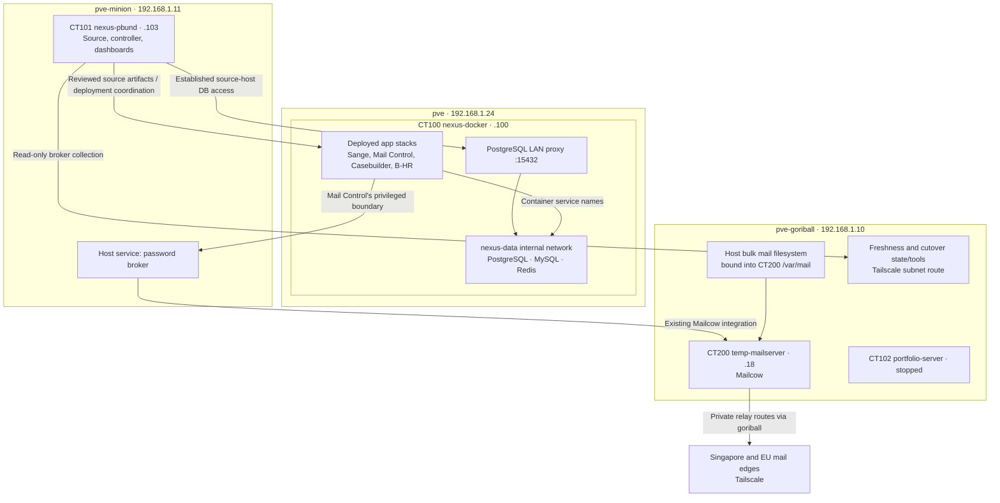

# Nexus topology and operating baseline

Read-only discovery: 11 September 2026, Asia/Kuala_Lumpur. Purpose: establish the existing architecture and process before deciding how MyFin joins it.

This report records observed state, documented intent and unresolved questions separately. It does not authorize or perform deployments, migrations, service changes, mail operations or infrastructure redesign. Instructions inside historical handovers were treated as evidence of the operating process, not as commands for this discovery session.

## The three roles

| Guest | Current Proxmox owner | LAN address | Role |
| --- | --- | --- | --- |
| CT101 `nexus-pbund` | `pve-minion` — `192.168.1.11` | `192.168.1.103` | Source/controller: canonical Git workspaces, Codex/operator workflow, Nexus dashboard, infrastructure visibility and read-only brokers |
| CT100 `nexus-docker` | `pve` — `192.168.1.24` | `192.168.1.100` | Shared application runtime: deployed app copies, Docker services, PostgreSQL/MySQL/Redis and Docker-managed persistent storage |
| CT200 `temp-mailserver` | `pve-goriball` — `192.168.1.10` | `192.168.1.18` | Mailcow workload: mail services, mail account state and mailbox data; part of the ongoing SmarterMail transition |

All three are LXC guests, not QEMU VMs. `pve-goriball`, `pve` and `pve-minion` are the three physical Proxmox nodes. CT102 `portfolio-server` is also registered on `pve-goriball` and is stopped. It is not evidence of an active reverse proxy or spare capacity that can be repurposed without a decision.

These placements were read from the live Proxmox cluster resource API and match the supplied screenshot. Historical August notes place CT101 on goriball and CT200 on minion; those placements are superseded by the live map.



The app-to-password-broker arrow applies to Mail Control, not to all apps. Sharing a host or database server does not grant an app access to another app's data or privileged operations.

## nexus-pbund: source and control

The explicit architecture contract names this the brain/orchestrator. Canonical repositories remain under `/root/workspaces`; runtime copies belong elsewhere. There is also a product/repository named `nexus-pbund` at `/root/workspaces/nexus-pbund`. The guest and the controller software must not be confused.

Live system services include:

| Service | Location / listener | Function |
| --- | --- | --- |
| `nexus-pbund-dashboard.service` | `/root/workspaces/nexus-pbund`, port 5000 | Nexus operator/controller application |
| `infra-control-deck.service` | `/opt/infra-control-deck`, port 5179 | Infrastructure inventory and visibility |
| `b-hr-control.service` | `/root/workspaces/b-hr-system-control`, loopback 5055 observed | B-HR discovery/knowledge control |
| `bayam-mail-freshness-broker.service` | `/opt/bayam-mail-freshness-broker`, `.103:9445` | Read-only freshness interface |
| `bayam-mail-operations-broker.service` | `/opt/bayam-mail-operations-broker`, `.103:9446` | Read-only infrastructure/mail operations interface |
| `cloudflared.service` | Token-file-managed tunnel | Public application ingress forwarding to runtime origins |

A local Postfix service listens on loopback port 25. Its presence does not make this guest the corporate Mailcow server or prove a suitable application SMTP delivery route.

The platform contract keeps project databases on nexus-docker. Source-host access follows the already accepted bridge:

```text
nexus-pbund
  -> 192.168.1.100:15432
  -> nexus-postgres-lan-proxy
  -> nexus-shared-postgres:5432
```

This is distinct from application-container database access. Do not move database files into `/root/workspaces`, install a second project database server here, or assume the controller is a disposable build worker: it also carries operational brokers and a tunnel.

## nexus-docker: deployed applications and shared services

Live inventory showed 13 running containers. CT100 has an allocation of four CPUs, 12 GiB RAM and an approximately 80 GiB root disk. Its filesystem showed approximately 49 GiB available during discovery. These are samples, not a load test or a commitment of capacity to MyFin.

| Application | Compose project / runtime directory under `/srv/docker/apps` | Origin |
| --- | --- | --- |
| Sange production | `sange-integrator` | `.100:8080` |
| Sange development | `sange-integrator-dev` | `.100:8081` |
| B-HR development web | `b-hr-system-dev` | `.100:8082` |
| Casebuilder development API/web | `b-casebuilder-dev` | `.100:8092` |
| Bayam Mail Control API/web | `bayam-mail-control-dev` | `.100:8093` |

The remaining containers are the PostgreSQL LAN proxy and the shared PostgreSQL, MySQL and Redis services.

| Shared service | Verified configuration |
| --- | --- |
| PostgreSQL | `nexus-shared-postgres`; image `postgres:16-bookworm`; server reports **16.14** |
| MySQL | `nexus-shared-mysql`; image `mysql:8.4` |
| Redis | `nexus-shared-redis`; image `redis:7.2-bookworm` |
| Data network | `nexus-data`, marked internal, `172.18.0.0/16` |
| Platform Compose project | `nexus-platform` |
| Platform configuration | `/srv/docker/platform/nexus-docker-foundation` |
| Docker data root | `/srv/docker/docker-data` |
| PostgreSQL LAN bridge | `nexus-postgres-lan-proxy`, attached to both `bridge` and `nexus-data`, host port 15432 |

Applications on `nexus-data` use `nexus-shared-postgres:5432`, not `.100:15432`. The runtime standard already provides Node and Laravel templates at `/srv/docker/platform/app-runtime-standard`; MyFin should be evaluated against that standard before inventing a new deployment layout.

The database catalog contains `platform`, `sange_control`, `sange_control_dev`, `bt_dev`, `b_casebuilder_dev`, `bayam_mail_control_dev` and the maintenance database `postgres`. No MyFin database was present in that catalog. Only database metadata was queried; application records were not read.

Existing app/database relationships must remain separate. In particular:

- Sange has a control-database/tenant-database architecture. Its identity, tenant membership and provisioning contracts are app-specific.
- Mail Control stores transition workflow, audit and support/control metadata. Mailcow remains authoritative for mailbox accounts, aliases, quotas, authentication and mail data.
- A `dev` suffix is not a permission boundary. Mail Control's `bayam_mail_control_dev` database and `bayam-mail-control-dev` runtime are operationally important and protected.
- The presence of shared PostgreSQL does not establish shared SSO or authorize MyFin to reuse another application's user tables.

PostgreSQL reported `archive_mode=off` and `ssl=off`. The LAN proxy is published on IPv4 and IPv6 wildcard addresses. These observations do not prove internet exposure, a missing external backup system, or a need to change the accepted bridge during this task. They do mean that transport boundaries, backup coverage and least-privilege access must be reviewed before adding a financial workload. No settings were changed.

Backup directories exist under `/srv/docker/backups`, including app release backups and `source-gorilla`. Their existence does not prove automated off-host database recovery. A CT101 archive was also present on goriball. Backup schedules, coverage and restore success remain outside what this inventory established.

## temp-mailserver: Mailcow and mail storage

Despite the name, this is the active Mailcow service guest and migration target, not an empty temporary sandbox.

- CT200 runs on goriball at `.18`, currently obtained through DHCP.
- Allocation: four CPUs, 8 GiB RAM, 40 GiB root filesystem.
- Mailcow runtime: `/opt/mailcow-dockerized`; 18 running containers were observed.
- Its own stack includes Postfix, Dovecot, Rspamd, SOGo, Nginx, MariaDB, Redis, antivirus and supporting services. Those MariaDB/Redis instances belong to Mailcow and are separate from nexus-docker's shared services.
- The guest has a Proxmox power-guard hook, `bayam-ct200-power-guard.pl`, in its configuration. Its presence was recorded; the guard was not executed or modified.

The current mail-data path was verified through both the guest mount and Docker volume metadata:

```text
goriball: /dev/mapper/bayam--mail--bulk-mail (ext4, ~1.8 TiB)
  -> /srv/bayam-mail-preseed-200
  -> CT200 bind mount /var/mail
  -> /var/mail/vmail
  -> Docker volume mailcowdockerized_vmail-vol-1
  -> Dovecot /var/vmail
```

Approximately 674.5 GiB was used on that bulk filesystem at observation. Mail indexes use a separate Docker volume. The 40 GiB guest root statistic is therefore not the mailbox-data capacity or usage.

The old EmailLake design in Drive describes a ZFS warm tier and cloud archive. The current live mailbox path is the ext4 bulk mount above, while the Proxmox storage entry named `EmailLake` was disabled on goriball. Do not equate the old design, the disabled storage entry, the current mailbox disk and verified off-site archives. Their names do not prove identical backing storage or completed archival.

MyFin should not be placed in this guest or given access to its mailbox volumes. Any future notification-email integration should use an explicitly selected SMTP contract without coupling MyFin to mail migration internals.

## Supporting host and edge responsibilities

The three guests do not contain every operational dependency:

| Location | Observed or documented responsibility |
| --- | --- |
| `pve-goriball` `.10` | Hosts CT200; owns current bulk mail mount; Tailscale subnet routing; current freshness/delta tools and state |
| `pve-minion` `.11` | Hosts CT101; runs the password broker and the older migration progress web service; existing SSH jump to mail edges |
| Singapore `bayam-mail-edge-sin` | Mail edge, Tailscale `100.126.240.119`; exact public-role readiness remains owned by the current mail workstream |
| EU `bayam-mail-support` | Mail edge/relay, Tailscale `100.119.55.47`; latest inspected repair evidence identifies it as the current outbound relay on 2525 |

On goriball, the existing controls include `/usr/local/sbin/bayam-freshness-agent`, `bayam-cutover-delta*`, `/var/lib/bayam-mail/freshness`, and `/opt/bayam-mail-migration/cutover-control`. These paths were found on goriball, not on CT200 or the old minion paths checked during discovery. No migration tool was run.

Today’s CT200 routing table contains both private relay routes through `.10`; its default gateway remains `.254`. The September 11 repair receipt records successful route repair, persistence configuration awaiting activation, no lifecycle test, and a disarmed rollback watchdog. Its EU TLS handshake passed; SG's private listener failed certificate verification. That SG result does not by itself describe public webmail/client TLS or require switching the outbound relay.

No SMTP messages, authentication attempts, sync jobs, route repairs or cutover verifiers were triggered by this discovery.

## Public application routing

The latest configuration entries found in the running cloudflared service's recent journal show this mapping:

| Hostname | Origin |
| --- | --- |
| `sys.bayam.live` | `http://192.168.1.100:8080` |
| `sys-dev.bayam.live` | `http://192.168.1.100:8081` |
| `btravel-dev.bayam.live` | `http://192.168.1.100:8081` |
| `bhr-dev.bayam.live` | `http://192.168.1.100:8082` |
| `mail-control.bayam.live` | `http://192.168.1.100:8093` |

This confirms an established tunnel/configuration pattern and existing assignments. It is not a full authoritative-zone inventory or a fresh public reachability test. `mail.bayam.com.my` is a separately important mail-client identity; it must not be conflated with `mail-control.bayam.live` or assigned to MyFin.

An additional MyFin hostname and an unused origin port still need an explicit assignment. Preserve existing routes, catch-all behavior, mail DNS and the source-host tunnel dependency.

## Capacity follow-up: 12 September 2026

Read-only samples were taken at approximately 02:36–02:40 MYT. The physical `pve` host and CT100 were checked separately; CT100's configured 12 GiB ceiling is not additional memory beyond its physical host.

| Measurement | Observed result |
| --- | --- |
| Physical `pve` CPU | Four CPUs; preceding 24-hour average 1.27%, highest one-minute average 2.86% |
| Physical `pve` memory | Approximately 3.1 GiB used and 8.5 GiB available at the live status read; preceding-day reported usage peaked at 2.99 GiB |
| Physical swap / I/O | 5.2 MiB swap resident, no swap-in/out during the short sample; preceding-day average I/O wait 0.22% |
| CT100 CPU | Preceding-day average 0.53%, highest one-minute average 1.13% |
| CT100 memory | Approximately 1.24 GiB by Proxmox counters; no guest swap or memory/I/O pressure reported at the live read |
| Containers | 13 running; three Docker statistics snapshots showed light activity |
| PostgreSQL | Approximately 101 MiB reported by Docker; `max_connections=100`; 11 other client sessions plus the inspection session, with five additional background processes |
| CT100 root filesystem | 79 GiB filesystem, 27 GiB used, 49 GiB available |
| CT100 `/srv/docker` | Separate 295 GiB filesystem, 487 MiB used, 279 GiB available |

The history contains 1,440 one-minute averages from 11 September 02:40 through 12 September 02:39 MYT. These values establish recent headroom, not an instantaneous peak or a forecast for checkout traffic, imports or image builds. Docker and Proxmox use different memory accounting; do not add their usage figures or mistake an individual container's displayed memory ceiling for reserved RAM.

Storage needs two budgets: Docker 29.5.3 reports `/srv/docker/docker-data` as its data root and `io.containerd.snapshotter.v1` as its storage backend, while `/var/lib/containerd` resolves to the root filesystem. Docker's containerd store has a separate data location; setting Docker's data root does not move it automatically. Therefore, do not treat the 279 GiB available on `/srv/docker` as guaranteed image-build capacity. The attempted directory-size traversal timed out after 45 seconds, so exact per-directory physical usage was not established. `docker system df` reported 24.4 GB of images and 20.31 GB of build cache; these are Docker accounting figures and must not be summed as unique physical disk usage. No pruning, data relocation or daemon restart was performed. Reference: [Docker containerd storage](https://docs.docker.com/engine/storage/containerd/).

**Planning conclusion:** current evidence supports adding a modest MyFin development web/API stack. Proposed starting limits are 128 MiB / 0.25 CPU for static web and 512 MiB / 1 CPU for the API, with at most five PostgreSQL connections per single API process. These are initial test settings, not measured application requirements. Validate import/checkout/file workloads, total pool size across replicas, and build-time consumption before production sizing. Build one app image at a time and preserve physical-host headroom.

The existing PostgreSQL databases remain separate applications: `platform`, `sange_control`, `sange_control_dev`, `bt_dev`, `b_casebuilder_dev`, and `bayam_mail_control_dev`. No MyFin database exists yet. Small catalog sizes and idle connections support a development trial but do not establish restore coverage or production service guarantees.

## Source state and release discipline

The written contract and current evidence agree on this sequence:

```text
Current evidence and scoped intent
  -> source changes on the controller
  -> bounded verification / disposable acceptance
  -> reviewed source checkpoint or complete dirty-source artifact
  -> separate approved deployment
  -> runtime/source/config verification
  -> operator acceptance and retained rollback evidence
```

The existing process requires one active writer per project, exact host/destination and scope, preserved intentional dirty work, separate source/deployment phases, and evidence before claiming a pass. The Run Console's readiness, review, finalizer and restart states are meaningful gates. Dashboard refresh or a zero command exit code alone does not prove completed deployment or correct business behavior. Discord is not an alternate execution/approval path.

Runtime copies under `/srv/docker/apps` are artifacts, not canonical Git source. Use the existing app's exact Compose files/project and deployment helper; do not rely on Compose auto-discovery in a repository root. Never perform broad platform `down`, prune, volume manipulation or destructive sync as a side effect of deploying one app.

Current repository observations:

| Repository on nexus-pbund | Observed branch / HEAD | Working state |
| --- | --- | --- |
| `/root/workspaces/nexus-pbund` | `main`, `bc5dd0f025e6a5908f0b247284e765ffc361baef` | Two untracked diagnostic scripts |
| `/root/workspaces/sange-integrator` | `codex/full-worktree-20260523`, `04bea39901b880d473eeb275e21dee6b6cda4899` | Intentional ongoing changes; current docs preserve dev/prod and rollback boundaries |
| `/root/workspaces/bayam-mail-control` | `master`, `f84ff5892eddf56f51c6bc300187cdbb75392fe6` | O4/O5 candidate changes remain in the worktree |
| `/root/workspaces/imported/sange-myfin-manager` | `main`, `417d1f7226ab2cb3efbcaee065f0f0db5d5c18e1` | Hosting cache modification; older code than this Windows checkout |

Mail Control's September 9 O3B deployment report records accepted deployment and the `f84ff58` source checkpoint. The September 10 O4/O5 V3 report says **BLOCKED_BEFORE_DEPLOYMENT**, including a candidate/Mailcow response mismatch and unfinished release prerequisites. Candidate source must not be mistaken for what is running. This task did not retry, resolve or take ownership of that release.

## Corrections that matter for MyFin

1. **Use the existing source/runtime split.** My first proposal did not establish the controller's role or its runtime-template/deployment contracts. Those now precede implementation choices.
2. **Reconcile MyFin source first.** This Windows checkout is at `c49b3e82249ee9e51de967c0c4bebb4a58ce7d56`, with additional local work already identified. The imported controller checkout is at `417d1f7`; its `src/store/editionStore.js` is absent and sampled Firebase/product files differ. It is not ready to serve as the migration baseline. Preserve both; decide and verify an explicit source promotion without overwriting current work.
3. **Reuse shared PostgreSQL deliberately.** A new MyFin app database and role can fit the established runtime architecture, subject to a separate reviewed change. Do not insert MyFin tables into `platform`, `sange_control` or `bayam_mail_control_dev` by convenience.
4. **Preserve mail isolation.** MyFin source and app deployment do not need changes to CT200, mail brokers, mail freshness state, relay routing, MX, mail domains or Mail Control's candidate release.
5. **Do not impose a new VM/proxy/database topology.** The actual platform uses LXC, shared services, per-app runtime copies and Cloudflare ingress. Any change to that arrangement needs its own evidence and scope.
6. **App design remains a decision.** The prior Node/Fastify/auth suggestions are options, not established platform commitments. Whether MyFin is standalone or integrated with Sange's identity/business model must be decided explicitly; shared infrastructure alone does not answer that.

A MyFin deployment should eventually be an additional isolated app stack on nexus-docker, sourced through the established controller process, with its own database/credentials/storage/domain and app-only deployment/rollback. No path, port, database, domain or server-side source promotion was created or reserved here.

## Evidence quality and remaining questions

Use current live observations for placement, mounts, running containers and database configuration. Use current release receipts for what was actually accepted/applied. Use repository contracts for intended ownership and process. Treat older chats, diagrams and mutable files called `current` as dated evidence that may need reconciliation.

Specific stale/conflicting evidence found:

- `/opt/infra-control-deck/config/inventory.json` still has old CT101/CT200 host notes and obsolete EmailLake capacity wording. It was not edited. The supplied screenshot and live cluster API show the current placement.
- The older Mail Control handover references an `8e70541` clean checkpoint; current source is `f84ff58` plus dirty O4/O5 work.
- `final-go-no-go-current.txt` is dated September 4 and still contains TLS/DMARC waits that later handover evidence says were resolved. It is not a fresh September 11 readiness verdict.
- The inspected PASS14 state file contains a summary of 384 PASS, four EXCEPTION and four DEFERRED, while later historical checkpoints describe 392/392 completion. These may represent different reconciliation stages. This inventory does not reinterpret or rerun the accepted mail process; current completeness remains a mail-workstream evidence question.

Still needed before implementation: reconcile/promote current MyFin source; decide app identity/integration boundary; assign domain/port; establish database-role and file-storage contracts; verify backup/restore coverage; and define the app-only deployment packet. The September 12 capacity follow-up supports a development trial; production sizing still requires measured MyFin workloads. Public mail cutover remains in its existing workstream and is not certified by this report.

## Evidence register

Primary live reads used SSH from this Windows host to the existing `nexus-pbund` alias, then existing trusted SSH from the controller to `.100`, `.10` and `.11`. CT200 inspection used `.10` and `pct exec 200`. The broken direct Windows alias to nexus-docker was not changed and no private keys or credentials were copied.

- Proxmox: `/cluster/resources --type vm`, `/nodes`, CT101/CT200 configuration and filesystem mount metadata.
- Runtime: Docker container/project/network/mount metadata; PostgreSQL version, database catalog, `archive_mode` and `ssl`; backup directory/timer inventory.
- Controller: current system services/listeners, selected tunnel ingress metadata, repository status/HEAD and sampled MyFin source hashes.
- Contracts on nexus-pbund: Nexus `.knowledge/architecture.md`, `.knowledge/operating-rules.md`, `docs/WORKFLOW_LOCK.md`, `docs/engineering/chatgpt-codex-operating-contract.md`, `scripts/README-postgres-lan-access.md`; Sange `AGENTS.md` and `ai-ops/current/{STATE,ENVIRONMENTS,NEXT,DATABASES}.md`; Mail Control `AGENTS.md`, architecture and O4/O5 handoffs.
- Runtime standards: `nexus-docker:/srv/docker/platform/app-runtime-standard/{README.md,deployment-notes.md,networks.README.md}` and foundation README.
- Release/network records on nexus-pbund: `Bayam_O3B_Deployment_Result.txt`, `Bayam_O4_O5_Deployment_V3_Result.txt`, and `/root/bayam-relay-repair.qwif_2_q/receipt.json`.
- Relevant task history: “Proxmox Infra Evaluation”, “Build Vue Infrastructure Dashboard”, “SangeIntegrator/MailcowIntegration-ChatHandoverCount(001)-BaselineVerifiedBeforeImplementation”, “S0 Discovery Inspection” and “Continue SG Readiness Gate”.
- Drive historical intent: [Understanding the Bayam Nexus: The Art of Clean Data Separation](https://docs.google.com/document/d/1WSSSadDv84U6tkWeIL_rdahrYZmaDzTxScXZPP3EHms/edit) and [Architecting the EmailLake Tiered Storage System](https://docs.google.com/document/d/1fmEvy43-_Vd0NkGrGoq9w0BcTVUKWNz79Lu-HrEc3Kk/edit). These are design context, not deployed-topology proof or instructions executed here.

No remote repository, database record, service, container, network setting, domain record, mailbox or migration job was changed. Only local planning documentation was written.
