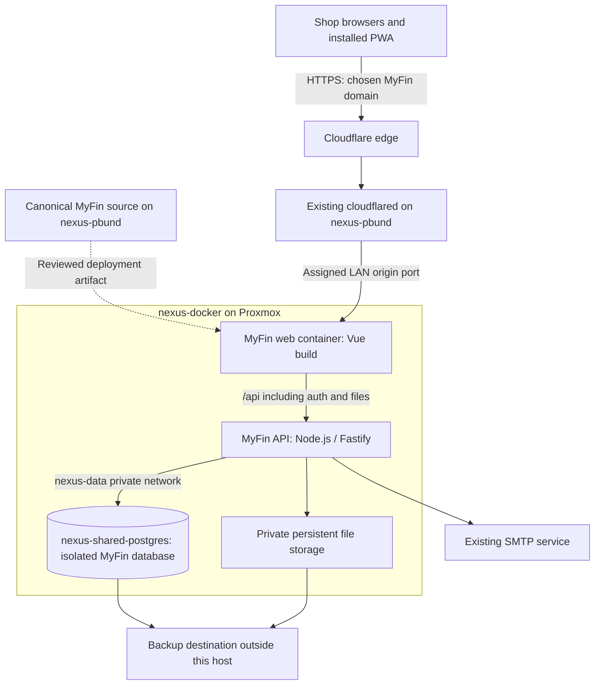

# MyFin: Firebase to PostgreSQL and nexus-docker

> Phase 02 update: this document retains the historical foundation/plan. The implemented PostgreSQL development build and current deployment gates are documented in [POSTGRES_DEVELOPMENT.md](POSTGRES_DEVELOPMENT.md) and the Phase 02 packet result.

> **Topology and capacity update — 12 September 2026:** Read [Nexus topology and operating baseline](NEXUS_TOPOLOGY_BASELINE.md) alongside this plan. Live discovery confirms nexus-pbund as source/controller, nexus-docker as app/shared-PostgreSQL runtime, CT200 as the separate Mailcow workload, and an existing Cloudflare Tunnel on nexus-pbund. A live check plus 24 hours of Proxmox history supports starting a small MyFin development stack. Source reconciliation, backend implementation, application acceptance and recovery validation still precede production cutover. These documents record the plan; they do not execute it.

Prepared 11 September; updated 12 September 2026. Status: topology established, development capacity checked, implementation and production readiness pending. No application, database, DNS, container or Firebase configuration was changed during this assessment.

## Decision

Keep the Vue 3/Vite application and move its services to a dedicated MyFin deployment on `nexus-docker`, backed by an isolated database in the existing PostgreSQL service. Introduce a server API that owns authentication, authorization, checkout, inventory and file access. Reuse the existing reverse proxy, domain provider, storage and identity service where they fit.

This is feasible, but it is a backend migration, not a Firebase connection-string replacement. Production execution depends on the infrastructure checks and acceptance gates below.

### Working deployment direction

1. **Establish current source on nexus-pbund.** Preserve the older `/root/workspaces/imported/sange-myfin-manager` checkout. Promote the intended current Windows source, including reviewed uncommitted inventory/POS work, to a canonical `/root/workspaces/sange-myfin-manager` workspace after checking destination occupancy. Compare a source-file manifest and hashes, retain the original until verified, and record one authoritative working copy. Exclude generated caches, dependencies, sensitive exports and secret files from source transfer; provision required runtime secrets separately.
2. **Develop the backend and Firebase replacement there.** Preserve Vue, receipts and domain behavior; add the API, PostgreSQL schema, authentication, authorized files and explicit offline catalog. Containerizing the current frontend alone leaves Firebase Auth/Firestore/Storage in use.
3. **Start with a development web/API pair on nexus-docker.** Suggested Compose project `myfin-dev`, deployed artifacts under `/srv/docker/apps/sange-myfin-manager`, and existing Node runtime conventions. These are proposed names and paths, not created resources. Initial test limits: web 128 MiB / 0.25 CPU, API 512 MiB / 1 CPU; one API process with a pool capped at five connections. Application tests and measured workloads determine later tuning.
4. **Reuse the PostgreSQL service with isolation.** Proposed development database `myfin_dev` and later production database `myfin`, each with independent credentials and restricted roles. The API joins existing `nexus-data` and reaches `nexus-shared-postgres:5432`; the browser talks only to the API. Sharing the server does not imply sharing Sange or Mail Control tables, users or permissions.
5. **Publish through the existing Cloudflare Tunnel.** Keep containers on nexus-docker. Add a selected owned hostname to the tunnel already running on nexus-pbund, forwarding to MyFin's web origin on an assigned unused `.100` port. Web serves Vue and proxies `/api` to the API container. Candidate names `myfin-dev.bayam.live` and `myfin.bayam.live` require availability/ownership checks and assignment; they are not reserved. Protect development access, and deploy a built frontend instead of exposing Vite's development server.
6. **Rehearse and then promote production.** Validate tenant boundaries, concurrent/idempotent checkout, offline recovery, imports, files, printing and restore before final migration. Drain or account for every device's old-origin queue before the domain transition. Retain application rollback evidence and the controlled Firebase cutover process below.

The recommended two containers are **web + API per environment**. Keeping development and production concurrently would ordinarily mean four MyFin application containers, using the existing PostgreSQL container with separate databases. The user's shorthand “dev/web” has not yet established a different packaging choice. No additional PostgreSQL/Redis service, mail-server work or replacement ingress platform is needed for this proposed first deployment.

Capacity evidence: physical `pve` averaged 1.27% CPU over the preceding 24 hours, with a highest one-minute average of 2.86%; CT100 used about 1.24 GiB by Proxmox counters. Physical memory available at the live read was approximately 8.5 GiB. Root filesystem space was 49 GiB available and `/srv/docker` had 279 GiB available on a separate filesystem. Image/build storage must also be budgeted against root because containerd has separate storage. Full measurements and limits are in the topology baseline. This supports a development trial, not a production-load guarantee.

## Evidence and limits

Verified from this working tree:

- `src/firebase.js` initializes Firebase Auth, Firestore with persistent browser caching, and Storage. `firebase.json` configures Firebase Hosting.
- Nine source files directly reference Firebase: the bootstrap, five store modules, `services/postSale.js`, `composables/useStorage.js`, and `components/dashboard/ProductsTab.vue`. The checkout wrapper also delegates to the Firebase finalizer.
- `src/store/editionStore.js` uses live subscriptions for users, companies, products, transactions, expenses, clients and activities. The transaction service also writes stock movements.
- `src/services/postSale.js` commits a sale, customer details, stock changes, stock movements and activity together, with stable-ID retry handling.
- `src/services/posLocal.js` stores carts and pending receipts in IndexedDB. The service worker caches the application shell; Firestore currently supplies the business-data cache.
- Finance includes invoices, quotes, quote conversion, project grouping, separate expenses and historical expenses held in transactions. Products include variants, fractional stock quantities, services, CSV import and images.
- Current local rules distinguish `super`, `company_admin` and `company_user`, enforce company boundaries and protect posted POS receipts. The earlier readiness report describes historical defects; it must not be treated as the current deployed rules assessment.
- The September 10 implementation notes report eight Auth identities and seven matching user profiles at that time. Current production counts were not queried during this assessment.
- The local `firebase-export-*` folder has emulator-style metadata. It is not established as a production backup and must not be used as the production migration source.
- This working tree already has unrelated uncommitted work. Implementation should begin from an agreed checkpoint that includes the intended inventory changes.

Infrastructure evidence:

- CT101 `nexus-pbund` (`192.168.1.103`) runs on `pve-minion`; CT100 `nexus-docker` (`192.168.1.100`) runs on `pve`; CT200 `temp-mailserver` (`192.168.1.18`) runs on `pve-goriball`.
- The direct Windows `nexus-docker` SSH alias has a missing configured key. Read-only discovery succeeded through the existing trusted Windows → nexus-pbund → nexus-docker route; no SSH configuration or trust was changed.
- `nexus-shared-postgres` runs PostgreSQL 16.14 on nexus-docker and serves existing isolated application databases over `nexus-data`. There is no MyFin database yet.
- Existing app runtime templates and artifact paths were inspected. Cloudflare Tunnel on nexus-pbund forwards existing owned-domain hostnames to app ports on nexus-docker. MyFin's exact hostname/port remains unassigned.
- Fresh shared-host capacity is recorded above and in the topology baseline. Backup directory existence was observed, but successful restore coverage, final MyFin file storage and application SMTP/identity arrangements remain unverified.

No production records were exported and no tests were run in this planning pass. Earlier test results in repository notes are historical evidence, not new validation.

## Target architecture

PostgreSQL runs in CT100 alongside the application stacks. Runtime connections use its container service name on `nexus-data`; source-host administrative access uses the existing LAN proxy where needed. SMTP remains an application integration decision, not authorization to change Mailcow. Node/Fastify and the identity library remain proposed implementation choices.

| Concern | Proposed choice | Reason / condition |
| --- | --- | --- |
| Frontend | Existing Vue/Vite build in a static web container | Preserves the interface, printing and document generation |
| API | Node.js supported LTS, Fastify, `pg`, reviewed SQL migrations | Fits existing JavaScript domain logic; supports explicit transactional checkout |
| Database | Separate `myfin` and `myfin_dev` databases in existing PostgreSQL | Reuses the server while isolating app data and credentials |
| Identity | Existing suitable OIDC identity provider if available; otherwise Better Auth with PostgreSQL | Replaces Firebase Auth without designing password/session cryptography |
| Files | Existing private object storage if available; otherwise a persistent API-owned volume | Simple deployment for current product images and expense attachments |
| Updates | Authenticated API reads plus server-sent invalidations and reconnect resync | Replaces Firestore listeners; periodic reconciliation handles missed notifications |
| Offline | Retained POS outbox plus explicit IndexedDB catalog/cache | Removing the Firebase SDK otherwise removes offline catalog reads |
| Deployment | Docker Compose using existing ingress conventions | No Kubernetes or extra platform is required |

Fastify documents deployment behind a reverse proxy. Better Auth supports PostgreSQL and email/password authentication; its reset-email callback requires a mail delivery implementation. Pin and review versions when implementing. Sources: [Fastify deployment recommendations](https://fastify.dev/docs/latest/Guides/Recommendations/), [Better Auth PostgreSQL](https://better-auth.com/docs/adapters/postgresql), [Better Auth email/password](https://better-auth.com/docs/authentication/email-password).

Self-hosted Supabase is an alternative if its combined Auth/Storage/Realtime platform is wanted. It adds a coordinated set of services and database requirements. For this app and the request to reuse an existing PostgreSQL server, the smaller API deployment is my recommendation; this is an engineering judgment, not a compatibility finding about your server. See [Supabase self-hosting with Docker](https://supabase.com/docs/guides/self-hosting/docker).

Use the existing LXC-based runtime and app deployment contracts. This plan does not require provisioning a VM or changing the platform's virtualization/storage arrangement.

## Domains, routing and network boundaries

Use one production origin, represented here as `myfin.<owned-domain>`, and a separate `myfin-dev.<owned-domain>`. These are placeholders, not verified domains. The development environment supplies the isolated staging/acceptance target described below.

- `/` and client-side routes serve the Vue app; `/api/*` reaches the API, including authentication and authorized file downloads. Match API routes before the SPA fallback so an API error never returns `index.html`.
- Prefer same-origin, host-only Secure/HttpOnly session cookies; configure trusted origins, CSRF protection, rate limits and only the actual proxy hops. Keep staging credentials and cookies separate.
- Reuse the existing Cloudflare Tunnel and a per-app web container for static serving and `/api` proxying. The discovery did not establish a need for a separate shared proxy product.
- With a usable public address, use the existing DNS and HTTPS ingress arrangements. Check both A and AAAA records, NAT, certificate renewal and reachability from the shop and outside the LAN.
- Under CGNAT or with no public inbound route, an existing Cloudflare Tunnel is a possible route if the chosen domain/account supports it. Tunnel establishes outbound connections and does not require a public server IP. It still depends on internet service. See [Cloudflare Tunnel](https://developers.cloudflare.com/cloudflare-one/networks/connectors/cloudflare-tunnel/).
- Keep PostgreSQL, Proxmox management and database administration interfaces private. Do not publish port 5432 to the internet. Restrict database access to required app/admin/backup paths.
- Inspect actual Docker port mappings and host/perimeter filtering. Docker manages networking/firewall rules, so a host firewall assumption alone does not establish isolation. See [Docker firewall behavior](https://docs.docker.com/engine/network/packet-filtering-firewalls/).
- Serve versioned static assets with caching; serve `sw.js` and HTML with update-friendly cache headers. Exclude private API responses and files from shared CDN and service-worker caches.

## PostgreSQL design and business behavior

Preserve existing IDs as text, including Firebase user UIDs. If an identity provider assigns different subjects, maintain an explicit subject-to-app-user mapping; historical cashier IDs and offline outbox ownership must still resolve to the same app user.

| Source | Target |
| --- | --- |
| companies and preferences | `companies`, with JSONB for flexible preferences/templates |
| users and Firebase identities | `app_users`, `company_memberships`, separate auth-provider tables/mapping |
| products and embedded variants | `products`, `product_variants`; preserve stable variant IDs |
| transactions and line items | `transactions`, ordered `transaction_items`; retain historical source/type/status and receipt snapshots |
| expenses | `expenses`; retain historical transaction-based expense lineage to avoid double counting |
| clients | `clients`, preserving customer/supplier details and company ownership |
| stock_movements | `stock_movements` and movement lines linked to the original sale |
| activities | Append-only `activities`, with historical raw actor information where required |
| Storage objects and embedded images | `files` metadata and private bytes; preserve embedded logo/QR values initially |
| New service concerns | `idempotency_keys`, durable change/event records, migration manifests |

Use integer minor units for money, `numeric` for quantities and rates, `timestamptz` for instants, and a separate business date in `Asia/Kuala_Lumpur`. Preserve date-only historical fields as dates. Match the existing line/discount/tax rounding order and transport large integer/decimal values without JavaScript precision loss. Keep the currency marker without silently interpreting legacy `RM` values as a different currency.

Enforce company scoping in every API handler and composite foreign key relationship. Use a restricted runtime database role separate from migration ownership. If row-level security is added, use transaction-local, server-derived tenant context and test with the real pooled runtime role. Superusers, `BYPASSRLS` roles and normally table owners bypass RLS; simply enabling policies is insufficient. See [PostgreSQL row security](https://www.postgresql.org/docs/current/ddl-rowsecurity.html).

Checkout must run in one PostgreSQL transaction:

1. Authenticate, resolve current membership and cashier identity, validate the complete request and its version.
2. Claim a unique `(company_id, sale_id)` idempotency key with a canonical business-request fingerprint. A concurrent retry waits/returns the committed result; reuse with changed contents returns a conflict.
3. Lock affected inventory rows in deterministic order, recheck stock and validate product/variant ownership. Compute totals on the server and apply the agreed price/tax/override policy.
4. Save the immutable sale and receipt snapshot, items, customer changes, stock deductions, movement records, audit entry and durable change event atomically.
5. Return the saved receipt. A lost response followed by a retry must never deduct stock again.

Keep online oversell rejection and the existing explicit review path for accepted offline sales that produce shortages. Do not let a browser-supplied `offline: true` alone grant an unrestricted stock or pricing bypass. Establish an authorized offline-device policy, retain captured price/tax versions and require review for conflicts. Online price validation should happen before payment collection; a sale already paid and queued must remain recoverable even when server validation requires review. No automatic instruction to collect payment again.

Retain manager-only deletion rules, immutable posted POS receipts with permitted project metadata changes, transactional quote conversion and validated bulk product import. Catalog/stock edits need optimistic version checks; inventory adjustments must update balances and audit movements atomically to avoid overwriting a concurrent checkout. Keep payment-terminal integration, refunds and shift reconciliation outside this migration unless separately scoped.

## Authentication, files and offline work

Authentication migration is separate from Firestore migration. The default plan is to import permitted users and memberships, preserve app identities, and require password enrollment/reset on the new system. Validate reset delivery before cutover, disable public self-registration, and revoke sessions on account disablement, password reset and relevant access changes. Users without an approved profile do not automatically receive store access.

Firebase uses a modified scrypt scheme. Its hashes must not be copied into an unrelated auth system as ordinary scrypt hashes. If keeping passwords becomes a requirement, implement and test a supported verifier/import or temporary identity bridge as a separate work item. See [Firebase Auth export/import](https://firebase.google.com/docs/cli/auth).

For files, inventory objects and references, download through authenticated storage access, hash-check copied bytes, retain MIME/size metadata and rewrite URLs to authorized file IDs/routes. Preserve the current limits: expense attachments up to 5 MB, images/PDF; product images up to 3 MB, JPEG/PNG/WebP. Do not rely on Firebase download-token URLs once Firebase is retired. File lifecycle needs staged uploads and retryable cleanup because SQL transactions cannot atomically commit filesystem/object-store operations.

Replace Firestore's cache with explicit company/user-partitioned catalog and necessary business-data stores. Retain durable sale IDs, outbox status, retry/review UI, draft/held orders and the distinction between saved locally and confirmed by the server. Recover after API restarts, expired sessions and missed live-update messages. Keep an explicit offline session policy; offline cache access is not proof of current server authorization, and revocations cannot reach a disconnected device immediately.

**A domain change does not carry browser storage with it.** Inventory every till, browser profile and installed PWA. Drain pending sales on the old origin; resolve errors or export/import pending receipts through a verified recovery workflow. Preserve original IDs and deduplicate against migrated server receipts. Recreate the new-origin cache and installation, and account for held carts. Never clear old browser data to force an upgrade while payments remain pending. See [IndexedDB same-origin behavior](https://developer.mozilla.org/en-US/docs/Web/API/IndexedDB_API).

## Execution sequence and acceptance gates

| Phase | Deliverable | Gate to advance |
| --- | --- | --- |
| 0. Infrastructure inventory | Topology, trusted access route, PostgreSQL and development headroom verified; finalize MyFin domain/port, storage, identity/SMTP and recovery contract | Known target and isolated staging path |
| 1. Source and deployment foundation | Preserve/reconcile current source onto nexus-pbund and verify manifest; reviewed app-only Docker build/Compose, separate DB roles, versioned migrations, staging HTTPS, health checks and secrets handling | Source baseline matches intended current work; staging can restart cleanly and connect using restricted credentials |
| 2. Backend implementation | Auth and access rules; CRUD, checkout, quote conversion, imports, files and updates | API tests pass against real disposable PostgreSQL |
| 3. Frontend migration | API adapters, auth replacement, updates and offline catalog; retained POS outbox | All application workflows function without the Firebase browser SDK |
| 4. Migration rehearsal | Repeatable export/transform/load scripts, raw manifests, file mapping and reconciliation report | Every source record is migrated or explicitly accounted for; restore works |
| 5. Operational rehearsal | Two tills, real printer, offline/restart/reconnect, expiry/revocation and external-domain tests | Signed-off workflow and measured cutover/restore duration |
| 6. Production cutover | Frozen source, final import, reconciliation, domain/app switch and monitored opening | Reconciled data, functioning logins/receipts/uploads and recoverable backup |
| 7. Retirement | Read-only Firebase retention period, checked archives, deployment workflow replacement, removal of old SDK/config/secrets and billable services | No residual clients, queued writes, old file links or recovery dependency |

Planned repository additions include `server/`, `db/migrations/`, `scripts/migration/`, `deploy/` and API integration tests. Replace Firebase access in the nine identified source files and checkout wrapper, and replace `.github/workflows/firebase-hosting-pull-request.yml` with the agreed image-build/staging deployment workflow. Deploy immutable image digests with a known previous image. Keep production DB migrations outside normal API startup and out of frontend builds. Never put DB passwords or auth secrets in `VITE_*` variables.

The deployment API should expose at least authentication/session endpoints, `/api/me`, company-scoped catalog/clients/finance/expenses/users/settings endpoints, an idempotent POS-sale endpoint, quote conversion, product import, authorized files and change synchronization. Live invalidation is an optimization: durable data plus reconciliation remain authoritative, including deletions/tombstones.

### Migration rehearsal details

Perform a fresh inventory of all collections, nested subcollections, identities and storage objects. Preserve a typed raw export containing document paths, timestamps, references and source metadata; transform it into relational data using an explicit mapping. Keep sensitive exports outside Git in restricted storage.

Managed Firestore exports can serve as recovery artifacts, but are not SQL imports. Ordinary exports may include changes made during the operation, so use a controlled write freeze for the final extraction. The managed service requires billing and selective collection exports do not implicitly include every nested subcollection. See [Firestore export/import](https://firebase.google.com/docs/firestore/manage-data/export-import).

Rehearse first against a separate database. Import parent identities/companies, then dependent records and file mappings. Preserve unknown fields in raw migration staging and document every exception. Do not guess missing company or product IDs. Legacy transaction items can retain descriptive snapshots without fabricated product relationships. Historical null-company activities belong in a restricted exception/archive path until resolved. Repeated imports must be safe against the same source manifest.

Import current stock balances and existing historical movements as records; do not replay sales against stock during import. Seed/check idempotency for migrated POS receipts so later recovery of an old queued receipt returns the existing sale rather than reposting it.

Reconcile counts and ID sets per company and entity; totals by company/date/type/status; legacy expenses without double counting; balances by product/variant; quote/invoice links; user access mappings; receipt snapshots; and file counts, sizes, hashes and references. Require zero unexplained monetary differences, missing records or duplicate receipt effects.

### Required tests

- Preserve current domain tests for rounding, tender, variants/services, CSV and receipt generation; add API/storage tests replacing Firebase-specific coverage.
- Two tills competing for the final unit; concurrent identical retries; response lost after commit; same ID with altered data; transaction rollback after an intermediate failure.
- Cross-company read/write/file denial; unauthorized role elevation; deleted/disabled users; session expiry; tenant context reuse under connection pooling.
- API timeout, offline restart, reload, multiple tabs, cached catalog, queued payment recovery, domain migration and reconnect with no duplicate deductions.
- Existing invoices/quotes and conversion, project grouping, expenses, clients, product CSV/images, settings, analytics and immutable receipt reprint.
- 58/80 mm printing and PDF/image access on actual shop browsers; verify private API errors do not become cached HTML or leaked CDN responses.
- Backup restore into an isolated destination, application restart/redeploy and previous-image rollback against the compatible schema.

### Cutover and rollback

Schedule cutover after a trading close. Before freezing writes, reconcile every device's outbox, including offline Firestore writes outside the explicit POS queue. Devices that cannot be inspected require an agreed recovery disposition. Freeze all old data/auth/file mutation paths as appropriate, including browser clients and admin writers, and verify the freeze. Do not allow both backends to accept shop writes.

Take the final complete source export, load PostgreSQL, copy final file changes, reconcile and back up the target. Test staff login and production routing before opening trading. If the hostname changes, install/warm the new origin on each till and retain old-origin recovery access. If the hostname stays, handle cached bundles/service workers and leave old Firebase writes disabled so stale clients cannot create a second source of truth.

Before any new PostgreSQL business writes, abort can restore the old app/routing and deliberately reopen the source. After new writes, DNS reversal alone is unsafe: keep PostgreSQL authoritative, use a compatible previous app image or a forward fix. A return to Firebase would require a new freeze and verified reverse migration of all PostgreSQL-era changes and pending device receipts. Keep a durable cutover checkpoint and audit trail.

## Operations and confirmation still needed

Establish encrypted backups outside the Proxmox/nexus-docker failure domain, with tested restoration of PostgreSQL, files, deployment configuration and needed secrets. Suggested targets for agreement: at most 15 minutes of committed-server-data loss and service restoration within four hours. These are proposed targets, not capabilities verified here; unsynced receipts exist only on their originating device.

Use scheduled logical dumps for portable app-level recovery and, if required to meet the recovery target, PostgreSQL base backups plus continuous WAL archiving managed with the database owner. A `pg_dump` is not a WAL base backup, and cluster-level PITR restoration can affect other applications: recover a shared cluster into an isolated instance first. Proxmox guest backups complement database/file backups. See [PostgreSQL continuous archiving](https://www.postgresql.org/docs/current/continuous-archiving.html).

Monitor API availability, errors/latency, disk/inode space, database connections, backup age/restore checks, WAL archival failures, certificate renewal and unresolved receipt queues. Confirm power/UPS, storage health and shop-to-server connectivity. If the server is at a different site, local internet loss remains an offline-POS event even though Firebase is gone.

Remaining implementation decisions and verification:

1. Verify the complete intended current source manifest before promotion to nexus-pbund; preserve both the current Windows work and older imported checkout.
2. Assign MyFin's development/production hostnames and unused web origin ports in the existing tunnel/account.
3. Finalize standalone versus shared identity integration, private file storage and an approved application SMTP route. Reusing PostgreSQL does not decide these product boundaries.
4. Identify the backup owner/destination and demonstrate isolated restoration of MyFin's database/files/configuration.
5. Establish number of tills, server/shop network relationship, acceptable trading interruption and recovery targets; measure the application under representative load.

No new access credentials are required for the completed topology/capacity discovery. The architecture supports a development implementation; production readiness and cutover remain subject to the application and recovery gates above.
