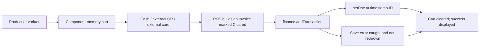
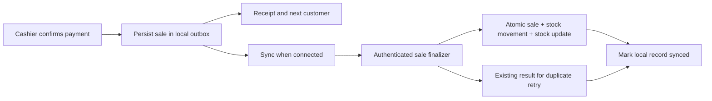

# Temporary shop POS: code and database assessment

Historical assessment before the Edition implementation. See
[Edition implementation and validation](EDITION_IMPLEMENTATION.md) for the
repairs, current behavior and remaining shop-device checks.

Reviewed 10 September 2026, Asia/Kuala_Lumpur. Live database inspection began at 2026-09-09 19:32 UTC.

**Decision: reuse this project and Firebase database, but do not rely on the current checkout for shop trading yet.** The app has useful catalog, company, invoice and POS interfaces. Its sale persistence, inventory, receipts and reporting need repair before they can be trusted at the counter. The deployed database also needs access controls before further operational use.

The requested scope includes offline checkout and receipt printing; barcode scanning can follow later. This plan accommodates multiple tills. Shop type, actual number of tills, device operating systems and printer model remain unconfirmed. Retail products and an 80 mm printer connected to a Windows PC are provisional planning assumptions, not verified hardware requirements.

## What was verified

- Read the current working tree, including its uncommitted product, finance, router and settings refactors. The application source and existing edits were preserved.
- Installed the locked dependencies and ran `npm.cmd run build`: successful, 402 modules transformed. There are bundle-size, mixed static/dynamic import, and stale Browserslist warnings. Build success does not establish correct checkout behavior.
- Ran [the local characterization audit](F:/Codex/GitHub/sange-myfin-manager/scripts/audit-pos-readiness.mjs): **15 of 15 reported defects reproduced**. These checks execute source logic with small in-memory Vue/Firestore doubles. They do not exercise a real browser, Firebase emulator, payment terminal or printer. `REPRODUCED` means a defect exists, not that a correctness test passed.
- Used the existing Firebase CLI account for authenticated, read-only inspection of deployed rules, database configuration, collection counts and selected document fields. Query limits were 100 transactions and 30 documents per other collection. All seven collections fit those limits at inspection time. Fields were projected; this was not a full content export or a consistent point-in-time backup.
- Saved aggregate diagnostics only. No raw customer documents, credentials or payment QR contents were saved in the assessment artifacts. No production records, rules or deployment were changed.

Evidence: [local behavior checks](F:/Codex/GitHub/sange-myfin-manager/docs/pos-readiness-evidence.json), [live database diagnostics](F:/Codex/GitHub/sange-myfin-manager/docs/firestore-readonly-evidence.json), and [read-only inspection script](F:/Codex/GitHub/sange-myfin-manager/scripts/audit-firestore-readonly.cjs).

The current local source and the live database were inspected independently. The deployed website bundle was not compared with this working tree, and no live checkout was performed.

## Existing architecture and reusable parts

This is a Vue 3 application with Vue Router and a shared reactive store. Firebase Authentication handles sign-in. Browser code reads and writes Cloud Firestore directly. Firebase Storage holds expense attachments; company logos and payment QR images are also stored as image strings in company documents. Firebase Hosting serves the Vite build. There is no checkout backend or Cloud Functions implementation in this repository.

| Area | Main code | Assessment |
| --- | --- | --- |
| Bootstrap and company sessions | [store/index.js](F:/Codex/GitHub/sange-myfin-manager/src/store/index.js:58) | Reuse after fixing authentication initialization, subscription cleanup and company scoping. |
| Cashier interface | [PosTab.vue](F:/Codex/GitHub/sange-myfin-manager/src/components/dashboard/PosTab.vue:13) and `pos/` components | Reuse product selection, category filtering, variant selection, cart and payment layout. |
| Catalog | [ProductsTab.vue](F:/Codex/GitHub/sange-myfin-manager/src/components/dashboard/ProductsTab.vue:18), product editor, inventory module | Supports prices, costs, units, services and variants; needs stable identities and sale-linked stock movement. |
| Sales and invoicing | [finance/SalesTab.vue](F:/Codex/GitHub/sange-myfin-manager/src/components/dashboard/finance/SalesTab.vue:80) | Keep invoice/quote workflows, but separate them from immutable completed shop sales. |
| Payments | [PosPaymentModal.vue](F:/Codex/GitHub/sange-myfin-manager/src/components/dashboard/pos/PosPaymentModal.vue:19) | Cash/change calculation and manual method selection exist. QR and card are external payments, without processor verification. |
| Documents | [usePdfGenerator.js](F:/Codex/GitHub/sange-myfin-manager/src/composables/usePdfGenerator.js:15) and three document templates | A4 invoice export exists. It is not a thermal receipt implementation. |
| Reports and expenses | Overview, Analytics, Sales, Expenses | Useful screens, but incompatible status and amount conventions currently prevent reliable reconciliation. |

Current sale flow:

There is no stock deduction, durable local sale record, actual receipt print operation, or shift reconciliation in this flow.

## Live database findings

Project: `myfinmanager-1d2da`, database: `(default)`, location: `asia-southeast1`, Firestore Native / Standard.

| Collection | Documents | Role and compatibility observations |
| --- | ---: | --- |
| companies | 8 | Seven contain `preferences.tax`; none contain `preferences.taxRate`. Two contain a nonempty `qrCode`; none contain `qrCodeUrl`. |
| users | 7 | One super user, four company admins and two company users. Role and company assignment are profile fields. Auth UID/profile mapping still needs verification before changing rules. |
| products | 7 | Four use `sku`, three use `code`. Four contain 12 variants in total. None of those variants has a stable ID. Three products lack explicit `trackStock` and root `stock` fields. |
| transactions | 50 | 28 Invoice, 18 Quote, two Payment Voucher, one Expense, and one missing `type`. Statuses: 16 Cleared, three Paid, 14 Pending, 17 Converted. |
| expenses | 3 | Separate expense records use `amount`. The current Expenses screen writes elsewhere. |
| clients | 12 | Existing customer/supplier directory can remain. |
| activities | 23 | Historical records exist, including two with null company IDs. The current store neither writes nor subscribes to this collection. |

Of 79 transaction line items, only two contain `productId`. Eight transactions have a payment method, all recorded as Cash. One transaction has `amount` but no `total`. No duplicate document numbers were found in the inspected transactions; the timestamp collision and repeating receipt-number issues were reproduced using synthetic inputs, not observed historical losses.

**Live access rules are unrestricted.** The released Firestore rules match [firestore.rules](F:/Codex/GitHub/sange-myfin-manager/firestore.rules:5), including `allow read, write: if true;`. There is no authentication condition. Login screens and route guards do not provide database authorization. This finding establishes the deployed rule configuration; no attempt was made to exploit it or perform an anonymous write.

There are **zero configured Firestore backup schedules**. Point-in-time recovery and database deletion protection are disabled. This does not establish whether manual exports or backups exist elsewhere. The rules release inventory returned a Firestore release only; Storage object permissions and attachment accessibility were not independently verified.

## Problems that block shop use

| Priority | Finding and consequence | Source/evidence |
| --- | --- | --- |
| Immediate | Unrestricted deployed Firestore rules permit database access without the app's company and role controls. | Local rules line 5; live rules diagnostic matches the local file. |
| Before checkout | A rejected save is swallowed. The cashier sees success and the cart is erased even when no sale was stored. | [finance.js](F:/Codex/GitHub/sange-myfin-manager/src/store/finance.js:20), [POS completion](F:/Codex/GitHub/sange-myfin-manager/src/components/dashboard/PosTab.vue:94); POS-01. |
| Before checkout | A sale never deducts inventory. Stock-zero items remain sellable. The unused deduction helper has an empty variant branch. | [inventory.js](F:/Codex/GitHub/sange-myfin-manager/src/store/inventory.js:61); POS-02 and POS-14. |
| Before checkout | Timestamp document IDs can collide across tills or companies. `setDoc` replaces the document. Repeated completion while awaiting a save can create two sales. | [PosTab.vue](F:/Codex/GitHub/sange-myfin-manager/src/components/dashboard/PosTab.vue:78), finance line 13; POS-05 and POS-07. |
| Before checkout | Receipt printing only logs a message. The success modal passes no transaction, so its receipt button reaches an undefined `tx.number`. | [receipt handler](F:/Codex/GitHub/sange-myfin-manager/src/components/dashboard/PosTab.vue:108), success modal; POS-03. |
| Before offline use | Cart and parked orders live only in component memory. Navigation or reload discards them. Firestore durable persistence and a service worker are not configured. No durable queue or sync-state handling exists. | POS lines 13–14; [firebase.js](F:/Codex/GitHub/sange-myfin-manager/src/firebase.js:18); dashboard route rendering. |
| Before reconciliation | POS writes Cleared, Analytics counts Paid, and Overview counts all invoices regardless of settlement. Reports disagree. Overview reads expenses from transaction totals while the expense collection uses amounts. | [AnalyticsTab.vue](F:/Codex/GitHub/sange-myfin-manager/src/components/dashboard/AnalyticsTab.vue:20), Overview lines 22–27; POS-04. |
| Before reconciliation | Expenses saves and deletes through the transaction API, while its list subscribes to the expense collection. New expenses can disappear from the list. Existing expense edits target the wrong collection. | [ExpensesTab.vue](F:/Codex/GitHub/sange-myfin-manager/src/components/dashboard/ExpensesTab.vue:60); POS-11. |
| Before checkout | Company editors save `preferences.tax` and `qrCode`; POS reads `preferences.taxRate` and `qrCodeUrl`. Configured tax is ignored by this path; stored payment QR images are not shown. | CompanyManager lines 13, 40, 180; POS line 45; payment modal line 72; live field counts. |
| Before checkout | Money is calculated with unrounded decimals and formatted only for display. An entered amount matching the displayed total can fail the cash check. POS omits `taxRate`, and resaving a taxed POS invoice through Sales recalculates a different total. | POS-09 and POS-15. The 6% used in these probes is synthetic, not a tax recommendation. |
| Before multiple-company use | Company switches never unsubscribe old listeners. Late callbacks overwrite current state. Initialization is called in both `main.js` and `App.vue`. Logout leaves some arrays and listeners alive. | [store/index.js](F:/Codex/GitHub/sange-myfin-manager/src/store/index.js:76); POS-12. |

Further defects and missing operations:

- Product identity is discarded when creating transaction items; selected variants retain only a display name/price. Unit is forced to `Unit`. Cart merging uses name and price instead of product/variant ID (POS-02 and POS-08).
- POS searches `code`, so products created with `sku` cannot be found by their SKU (POS-10). Variant products display the root price, which may not represent any option.
- Receipt numbers keep only the last six timestamp digits. They can repeat after 1,000 seconds, or 16 minutes 40 seconds (POS-06).
- Cash received and change are emitted by the payment modal but not persisted. There are no register IDs, shifts, cash-in/out entries, or drawer-count reports.
- There is no refund, return, or sale-void workflow. Hard deletion and editing can remove or alter the record of money already received. Stock corrections have no movement ledger.
- `logActivity` only writes to the console. Existing database logs do not make the present implementation auditable.
- Appearance settings replace the whole company preferences map; changing a theme can erase tax and document settings (POS-13).
- The login component treats `Store.login()` as a synchronous boolean, leaving its button loading after failed login. The user manager calls a missing `Store.resetUserPassword` method. Deleting a Firestore user profile does not delete the Firebase Auth identity; access revocation needs enforceable rules and session handling.
- Date handling mixes UTC date strings and browser-local day calculations. Daily reports need one shop timezone and business-date rule.
- The PR Hosting workflow has no install/build steps in a clean checkout, while `dist` is ignored. It is not a verified release pipeline.

## Implementation plan while retaining the existing database

### 1. Protect and establish the existing records

Create a recoverable export and verify restoration in an isolated environment before a migration. Confirm which of the eight companies is the shop. Validate Auth UID-to-profile ownership and restrict company/user queries before enforcing tenant-aware rules; simply requiring sign-in would still leave cross-company access possible.

Use rules that prevent staff from changing their own role/company, editing posted sales, or writing another company's records. Scope product, customer, user and company reads to authorized membership. Align Storage permissions with company ownership. Add deletion protection and a recovery arrangement appropriate to the project, without assuming existing settings provide it.

Create a read adapter for legacy fields: `sku`/`code`, `taxRate`/`tax`, and `qrCode`/`qrCodeUrl`. Preserve both historical statuses while normalizing their interpretation for completed invoices. Make an explicit decision on the anomalous records instead of guessing their meaning. Add version fields for new records. Fix Expenses against one canonical collection, with a reviewed migration for misplaced expenses.

**Do not reconstruct stock automatically from historical transaction descriptions.** Most lines lack a product ID; similarly named items, renamed variants, quotes and invoice conversions make that unreliable. Take a physical opening-stock count for the selected shop and record the adjustment separately. Preserve original sales and totals.

### 2. Add one reliable sale operation

Keep the POS components, but move completion into a dedicated service. Generate a random sale ID once, persist it locally, and use that same ID on every retry. Maintain a separate unique human-readable receipt number including a register/sequence component that works offline.

Prefer a small authenticated backend finalizer for authoritative writes. It should validate company, cashier, register, prices/authorized overrides and quantities; use a Firestore transaction to record the sale, stock movements and inventory changes together; and return the existing result when the same sale is submitted again. Reject reuse of a sale ID with different contents. A stable ID alone does not prevent duplicate stock deductions.

Do not attach stock deduction indiscriminately to `finance.addTransaction`: that API also handles quotes, invoices and currently expenses. Stock changes belong to an explicit posting/fulfilment operation, applied once.

Use integer sen for currency, with explicit line, discount and tax rounding. Use a suitable quantity representation for the shop's units. Persist product and variant IDs, SKU, item description, unit, price, applicable tax, cost snapshot where needed, cashier UID, register ID, business date, receipt number, payment method, cash received and change. Snapshot receipt details so later catalog/company edits do not rewrite the meaning of old receipts.

Keep existing product documents if practical. Assign stable IDs to the 12 variants. For this small catalog, a server transaction can safely read and update the parent product's variants by ID; a wholesale catalog migration is not a prerequisite. Add an append-only stock-movement collection for sales, returns and adjustments.

Disable repeated completion while saving, preserve the cart on failure, and make recovery visible. Store an immutable completed-sale snapshot for printing and reprinting. Correcting a posted sale should create a linked void/refund entry with a reason and the corresponding stock/cash reversal.

### 3. Make offline operation durable

The design needs an installed/cached app shell, a cached shop catalog, durable carts/held orders and a local IndexedDB sale outbox. Persist the sale and tender facts before reporting that they are saved on the till. Show the cashier the offline state, unsynced count, sync failures and recovery actions. Clear local data only when safe for that shop and session.

Firestore's default web cache is memory-only; durable persistence must be configured. It also uses last-write-wins for multiple changes to a document. These capabilities help caching but do not by themselves provide the sale operation described above. [Firebase offline documentation](https://firebase.google.com/docs/firestore/manage-data/enable-offline).

On reconnection, replay each durable sale through the same idempotent finalizer. Firestore read/write transactions fail offline, whereas batches can be queued offline; enabling persistence cannot turn a live stock check into an offline transaction. [Firebase transactions documentation](https://firebase.google.com/docs/firestore/manage-data/transactions).

Multiple disconnected tills cannot know each other's latest stock. For a temporary POS, the simplest proposal is to preserve all completed offline sales and flag shortages for manager reconciliation. Do not silently discard a sale after cash has been accepted. If the shop requires a hard guarantee against overselling during outages, allocate stock per till or introduce a shared local authority. That operational choice must be settled before implementing offline stock rules.

Previously provisioned tills should work through a connection outage. First-time setup, uncached data and a new Firebase sign-in cannot be promised offline. Payment acceptance is separate: recording an offline sale does not make a bank QR service or an external card terminal work without its own connectivity.

### 4. Receipts, payments and daily operation

Build a dedicated thermal receipt view with printer-width settings, store identity, stable receipt number, items, quantities, subtotal, tax/discount if applicable, total, payment method and cash/change. Print from the saved sale snapshot; reprint the same receipt number without creating another sale. Provide an A4/PDF fallback where useful. Printer failure must not repeat checkout.

Start by testing browser printing with the actual printer and OS driver. Silent printing, paper cutting and cash-drawer opening are hardware/integration requirements to establish after the printer model is known; they are not implemented today.

Retain external QR/card payment for the temporary version. Require the cashier to confirm the successful result on the merchant device and optionally record a reference. Merely displaying a QR or choosing Card must not imply processor confirmation. Integrated payment APIs can be a later phase.

Add quantity increase/decrease/direct entry, persistent held orders and recent receipt retrieval. Add register/shift opening balance, cash sales, refunds, paid-in/out, closing count and variance. Correct the revenue/expense reports and label measures accurately; current revenue-minus-expenses figures are not inventory-aware profit calculations.

Barcode scanner handling can follow this work. Reuse a normalized SKU/barcode lookup and ensure a scan identifies one product/variant before adding it to the cart.

## Smallest additional data model

| Record | Additions or rule |
| --- | --- |
| Existing companies/users | Verified UID membership, register access and compatible settings. Keep existing IDs. |
| Existing products | Canonical SKU, stable variant IDs, explicit unit/stock tracking; establish opening stock. |
| Existing transactions | Versioned POS records, source indicator, immutable item/tender snapshot, stable sale and receipt IDs, cashier/register/shift IDs, business date and timestamps. Preserve invoice/quote compatibility. |
| stock_movements | Company, sale/return/adjustment reference, product/variant, quantity delta, reason and actor. |
| registers and shifts | Device/till identity, company membership, opening/closing cash and reconciliation. |
| cash_movements | Cash paid in/out and linked cash refund entries. |
| activities | Enforced, append-only audit events. Historical logs remain historical. |
| Local IndexedDB | Durable carts, parked orders, catalog version and sale outbox; partitioned by company/register. |

These are proposed additions, not changes already applied to production.

## Acceptance checks before the first trading shift

| Scenario | Required result |
| --- | --- |
| Anonymous access; cashier from another company; role-edit attempt | Database denies access regardless of UI. |
| One cash sale and one external payment sale | Exactly one saved sale each; correct totals, tender and change. |
| Simple product and two variants | Correct inventory changes and a matching stock ledger; service items do not decrement stock. |
| Double-click; timeout; retry; response lost after server commit | Exactly one sale and one set of inventory movements. |
| Two online tills sell the last item | Agreed stock policy enforced by the finalizer. |
| Offline checkout, refresh, then close/reopen the provisioned till | Saved sale, receipt and held orders survive. |
| Two tills sell offline and reconnect | Every real sale retained; deduplication and shortage reconciliation behave as agreed. |
| Reconnect with an expired/revoked session | Unsynced records remain recoverable; the app does not falsely report cloud completion. |
| Paper out, cancelled print and reprint | No new sale; original receipt and number remain accessible. |
| Return/refund/void | Original sale preserved; authorized linked cash and stock reversal recorded. |
| Open a posted POS sale in Sales | Historical totals remain unchanged; edits require a correction workflow. |
| Save an expense, reload, edit, then authorized deletion | Correct collection and amount convention throughout. |
| Shift close and local midnight | Cash report reconciles and all screens use the shop's business date. |
| Logout, switch company, delayed network response | Previous-company listeners and data cannot contaminate the new session. |
| Backup restoration drill | Restored records and totals can be checked in an isolated environment. |

The first implementation work should be the coordinated access-control/session repairs and sale/data-contract repairs. Thermal printing and durable offline operation then build on a stable saved-sale model. Scanner support remains deferred as requested.
